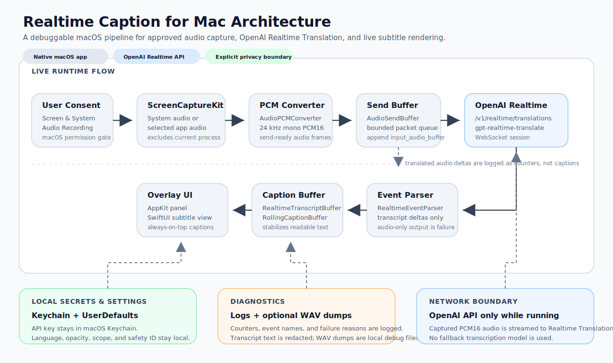

# Realtime Caption for Mac Architecture

Realtime Caption for Mac is a native macOS menu bar app that captures user-approved computer audio and streams it to OpenAI Realtime Translation for low-latency subtitles.



## Runtime Flow

```text
ScreenCaptureKit audio sample
-> AudioPCMConverter
-> 24 kHz PCM16
-> OpenAIRealtimeTranslator
-> /v1/realtime/translations?model=gpt-realtime-translate
-> transcript deltas
-> always-on-top AppKit/SwiftUI subtitle overlay
```

## Privacy Boundary

- The OpenAI API key is stored in macOS Keychain through `KeychainClient`.
- Audio capture uses macOS Screen & System Audio Recording permission.
- The app excludes its own process audio when capturing system output.
- Captured audio is streamed to OpenAI Realtime Translation while translation is running.
- Diagnostic input WAV files are saved locally under `~/Library/Logs/SoundTranslator` for debugging.
- Diagnostic logs store transcript character counts but redact transcript text.
- A stable random safety identifier is stored in user defaults and sent as `OpenAI-Safety-Identifier`.

## Capture Strategy

The first shipping implementation uses ScreenCaptureKit because it is available through public macOS APIs and supports system audio capture with user consent. The capture service is isolated behind `AudioCaptureService`, so a Core Audio Tap implementation can replace or supplement it later for process-tap specific routing on macOS versions where that is preferable.

## Distribution

`Scripts/package_app.sh` builds a release binary, wraps it in a `.app` bundle, copies the privacy usage strings, and signs the app. By default it uses ad-hoc signing for local testing. For production distribution, set `DEVELOPER_ID_APPLICATION` to a Developer ID Application identity before packaging, then run `Scripts/notarize_app.sh` with `NOTARYTOOL_PROFILE` set to a configured notarytool keychain profile.
